# 目录

[TOC]

# 介绍

## 系统简介

* 本系统分为客户端和服务端。主要实现各种定期活期的存取，利息计算。以及贷款借还和利息计算，信用处理等功能。

## 系统特色

* 布局规整，功能完备的UI界面。不仅实现了所要求的功能，而且增加了修改密码，注册账户，注销重新登陆，以及多种界面之间的流畅跳转。

  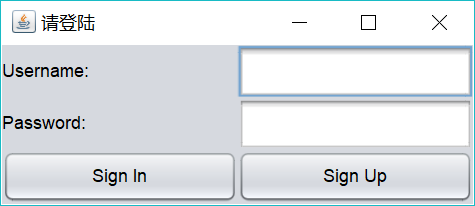
  

  

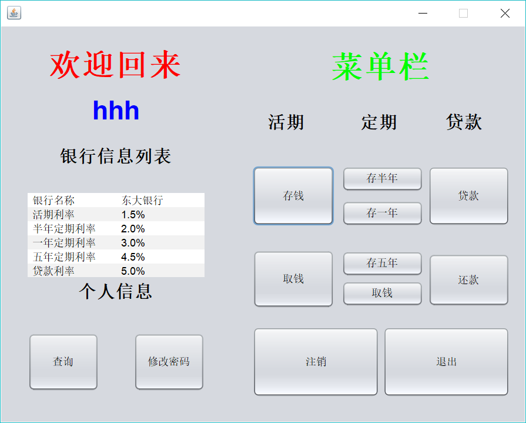

* 特色二 ： 丰富的输入检测和提示界面。下面是部分截图。

  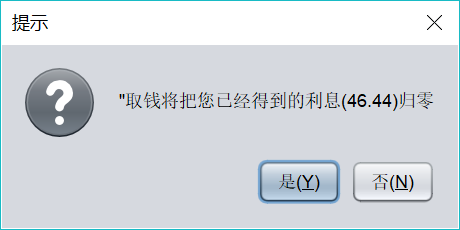

  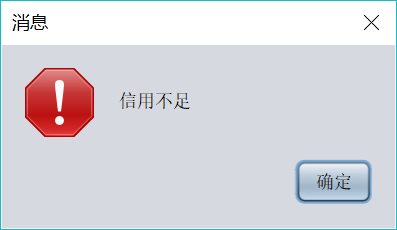

  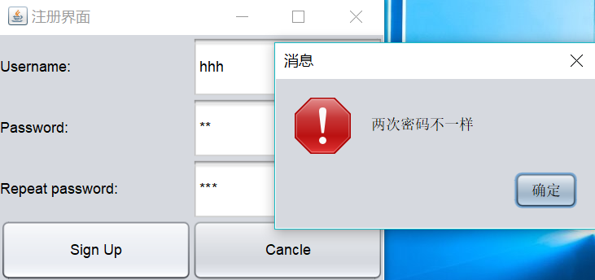

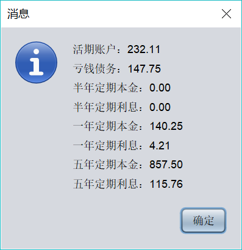

* 采用对象流通信。定义了应用层协议(protocol).下图是客户端和服务器协议栈的数据流图。

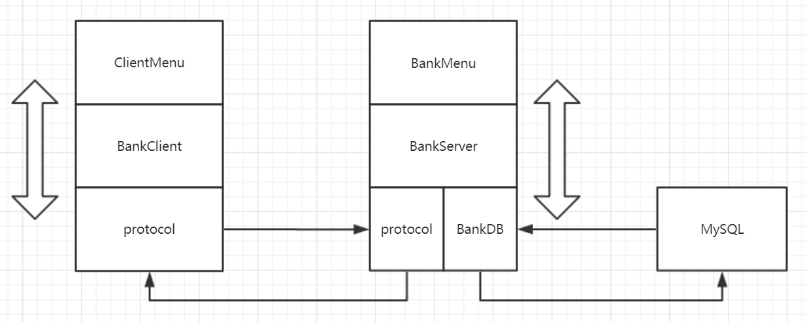

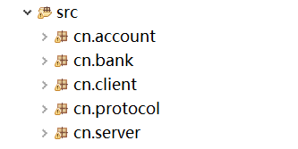

# 测试方法

## 数据库

* 代码为了方便助教（老师）调试。 专门提供了一个简单的调控区。老师可以根据自己的MySQL配置修改。（数据库在localhost）

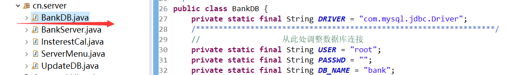

* 在数据库中建立一个表。（这个就得麻烦老师自己动手了）

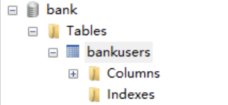

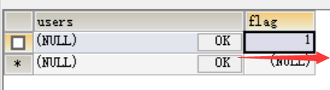

* 数据库调到这里就差不多了。

## 服务器

* 我导出了Jar包。但是由于引用了jdbc驱动的jar包。运行的时候可能找不到类。希望老师可以解决下。
* 如果在Eclipse中运行。 Server的入口在 cn.server包 的 ServerMenu.java文件中。

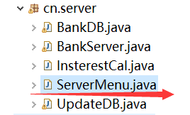

## 客户端

* 客户端不涉及jar包的问题。 
* 也可以从 cn.client 包的 ClientMenu 找到入口。

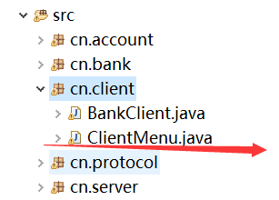

## 使用教程

* 启动BankServer。
* 启动BankClient。
* 这个时候，登陆界面出来了。
* 点击Sign up 先注册个账号。
* 然后输入你注册的账号密码，点击Sign In 登入。
* 这时候就进入主界面了。
* 其他功能慢慢发掘噢~

> 感谢，张翔老师的教导以及助教的幸苦。
>
> 再见ヾ(￣▽￣)Bye~Bye~
>
> 2018/1/24
